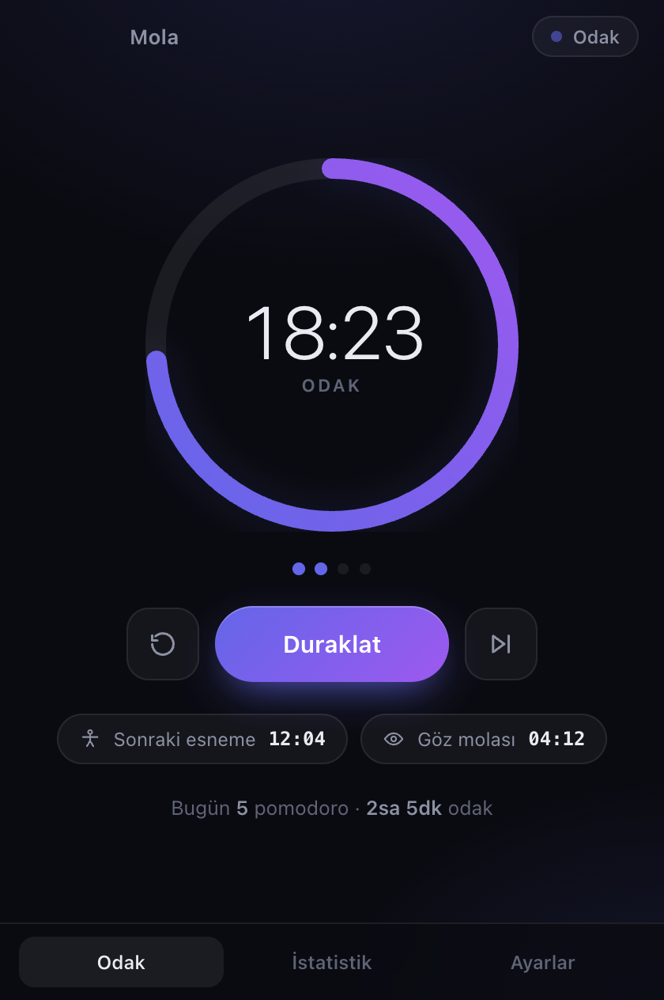
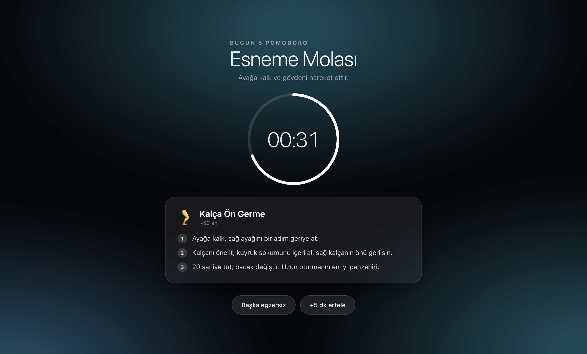
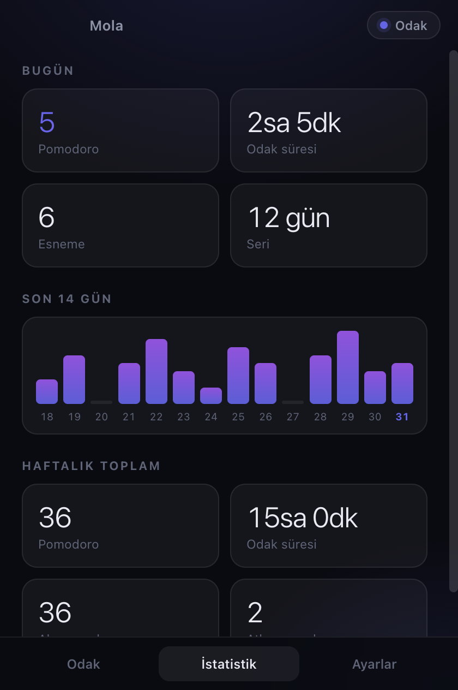
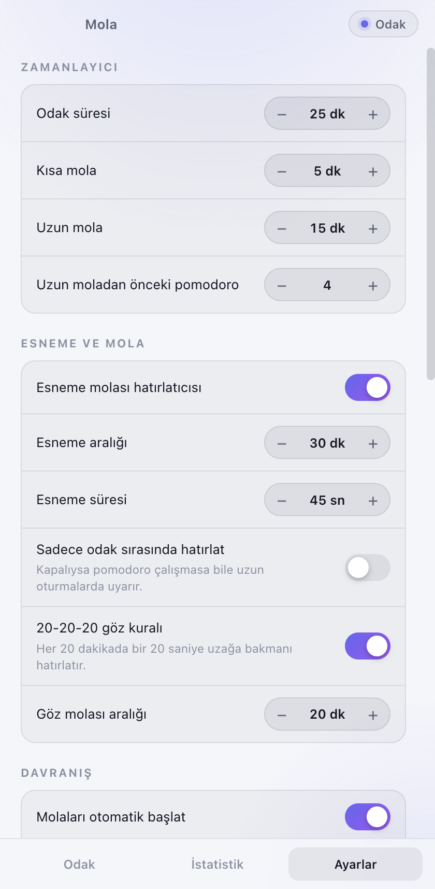

# Mola

Pomodoro zamanlayıcı + **esneme ve mola hatırlatıcısı**. Uzun oturma seanslarında
ayağa kalkmayı, gerinmeyi ve gözünü dinlendirmeyi hatırlatır.

macOS ve Windows'ta çalışır. Tek kurulum dosyası, sıfır yapılandırma, hesap yok,
internet bağlantısı gerektirmez, hiçbir veri dışarı çıkmaz.

| Odak | Mola ekranı |
|---|---|
|  |  |

| İstatistik | Ayarlar |
|---|---|
|  |  |

---

## Neden bu var

Klasik pomodoro uygulamaları sadece "25 dakika doldu" der ve susar. Asıl sorun
molayı *hatırlamak* değil, molayı **gerçekten vermek**. Mola bunu üç ayrı
mekanizmayla çözer:

1. **Pomodoro döngüsü** — 25 dk odak / 5 dk kısa mola, her 4 turda 15 dk uzun mola.
2. **Bağımsız esneme sayacı** — pomodorodan ayrı çalışır. Varsayılan 30 dakikada
   bir, ekranı kaplayan bir mola ekranı açar ve sana somut bir egzersiz verir.
   Pomodoro çalışmıyorsa bile devreye girer, yani "sadece esneme koruması" olarak
   da kullanılabilir.
3. **20-20-20 göz kuralı** — 20 dakikada bir, 20 saniye boyunca ~6 metre uzağa
   bakmanı hatırlatır (bildirim, ekranı kesmez).

Esneme molası odak saatini **askıya alır**: 25 dakikalık pomodoron esnemeye
harcanmaz, kaldığı yerden devam eder.

## Özellikler

**Mola motoru**
- Ayarlanabilir odak / kısa mola / uzun mola süreleri ve döngü uzunluğu
- Molaları ve odağı otomatik başlatma seçenekleri
- Mola öncesi uyarı bildirimi (varsayılan 30 sn önce)
- Pomodoro molası çok yakınsa esneme molası atlanır — üst üste binmez

**Esneme**
- 18 egzersizlik kütüphane: boyun, omuz, sırt, bilek, bacak, göz, nefes, duruş
- Adım adım anlatım, sıradaki egzersiz tekrar etmeden rotasyonla seçilir
- Uzun molalarda ayakta yapılan egzersizler önceliklidir
- "Başka egzersiz" düğmesiyle anında değiştirilebilir

**Mola ekranı**
- Tüm ekranları kaplar, tam ekran uygulamaların ve menü çubuğunun üstüne çıkar
- Üç katılık seviyesi: **Esnek** (atla + ertele), **Normal** (sadece ertele),
  **Katı** (3 saniye basılı tutarak çıkış)

**Akıllı davranış**
- Klavye/fare hareketsizliğinde odağı otomatik duraklatır; masadan 2 dakikadan
  uzun kalktıysan bunu zaten mola sayar ve esneme sayacını sıfırlar
- Uyku / ekran kilidi sonrası kendini toparlar, saatler sonra alakasız bildirim atmaz
- Pencereyi kapatmak uygulamayı kapatmaz; zamanlayıcı tepside/menü çubuğunda sürer

**Diğer**
- macOS menü çubuğunda canlı geri sayım, Windows'ta tepsi ipucu
- Global kısayol (varsayılan `⌘⇧M` / `Ctrl+Shift+M`), boşluk tuşuyla başlat/duraklat
- Günlük istatistik, 14 günlük grafik, seri takibi
- Açılışta başlatma, açık/koyu/sistem teması, Türkçe + İngilizce
- Ses dosyası yok — tonlar Web Audio ile üretilir

## Kurulum

### Hazır sürüm

`release/` klasöründeki dosyayı kullan:

- **macOS** — `Mola-1.0.0-arm64.dmg` (Apple Silicon) veya `-x64.dmg` (Intel).
  Aç, `Mola`'yı `Applications` klasörüne sürükle.
- **Windows** — `Mola-Setup-1.0.0-x64.exe`. Çalıştır, ileri de.

> **macOS ilk açılış:** Uygulama imzasız derlendiği için Gatekeeper
> "hasarlı" diyebilir. Bir kez şu komutu çalıştırman yeterli:
> ```bash
> xattr -dr com.apple.quarantine /Applications/Mola.app
> ```
> Apple Developer sertifikan varsa `electron-builder.yml` içindeki
> `identity: null` satırını sil ve `CSC_LINK` / `CSC_KEY_PASSWORD` ver.

### Kaynaktan çalıştırma

Node.js 22.12+ gerekir.

```bash
npm install
npm run dev
```

## Paketleme

```bash
npm run dist:mac    # .dmg + .zip  (arm64 + x64)
npm run dist:win    # NSIS kurulum .exe  (x64 + arm64)
```

Çıktılar `release/` klasörüne düşer.

**Windows paketini macOS'ta üretmek:** `electron-builder` .exe'nin ikon ve
sürüm bilgisini yazmak için `rcedit` kullanır, o da macOS'ta Wine ister
(`brew install --cask wine-stable`). En temizi Windows'ta derlemek ya da
`.github/workflows/release.yml` içindeki hazır GitHub Actions akışını
kullanmak — bir etiket (`git tag v1.0.0 && git push --tags`) her iki
platformun kurulum dosyasını da üretip Release'e ekler.

## Komutlar

| Komut | Ne yapar |
|---|---|
| `npm run dev` | Geliştirme modu, anlık yenileme |
| `npm test` | Zamanlayıcı motorunun durum makinesi testleri |
| `npm run typecheck` | TypeScript kontrolü (main + renderer ayrı) |
| `npm run build` | Tip kontrolü + üretim derlemesi |
| `npm run dist` | Mevcut platform için kurulum dosyası |
| `npm run icons` | Uygulama ve tepsi ikonlarını yeniden üretir |

## Veriler nerede

Ayarlar ve istatistikler düz JSON olarak, sadece senin makinende:

- **macOS** — `~/Library/Application Support/Mola/`
- **Windows** — `%APPDATA%\Mola\`

`settings.json` elle düzenlenebilir; geçersiz değerler sessizce varsayılana döner.
Ayarlar ekranındaki **Veri klasörünü aç** düğmesi buraya götürür.

## Mimari

```
src/
├── shared/          Ana süreç ve arayüzün paylaştığı katman
│   ├── types.ts     Tüm veri sözleşmeleri
│   ├── defaults.ts  Varsayılan ayarlar + doğrulama/aralık kırpma
│   ├── exercises.ts 18 egzersiz (TR/EN) + tekrarsız rotasyon
│   ├── i18n.ts      Türkçe/İngilizce metinler
│   └── api.ts       window.mola köprü sözleşmesi
├── main/
│   ├── engine.ts    Durum makinesi: pomodoro + esneme + göz + hareketsizlik
│   ├── store.ts     Atomik JSON kalıcılık, günlük istatistik, seri hesabı
│   ├── windows.ts   Ana pencere + tüm ekranlardaki mola overlay'leri
│   ├── tray.ts      Menü çubuğu / tepsi
│   └── index.ts     Yaşam döngüsü, IPC, bildirim, kısayol, güç olayları
├── preload/         contextBridge — sandbox açık, node entegrasyonu kapalı
└── renderer/        React 19 arayüz (ana pencere + overlay ayrı giriş)
```

Tasarım kararları:

- **Çalışma zamanı bağımlılığı yok.** Ayar saklama, açılışta başlatma,
  hareketsizlik algılama, ses — hepsi Electron'un ve platformun kendi
  API'leriyle. Paket küçük, güncelleme yüzeyi dar.
- **`engine.ts` Electron'a bağımlı değil.** Bu yüzden `npm test` onu sahte saatle
  gerçek uygulamayı açmadan test edebiliyor.
- **Güvenlik:** `contextIsolation` açık, `sandbox` açık, `nodeIntegration` kapalı,
  üretim derlemesine sıkı CSP enjekte edilir, uzak içerik yüklenmez.

## Sorun giderme

**`npm install` sonrası "Cannot find module 'electron'" veya `electron/dist` yok**
npm sürümün paket kurulum betiklerini engellemiş olabilir. Electron binary'sini
elle indir:
```bash
node node_modules/electron/install.js
node node_modules/esbuild/install.js
```

**`TypeError: Cannot read properties of undefined (reading 'isPackaged')`**
Ortamında `ELECTRON_RUN_AS_NODE=1` set (bazı editör terminalleri bunu yapar).
Electron düz Node olarak çalışıyor demektir:
```bash
env -u ELECTRON_RUN_AS_NODE npm run dev
```

**"Açılışta başlat" açtığımda bir şey olmuyor**
Geliştirme modunda (`npm run dev`) bu ayar bilerek sisteme yazılmaz — yoksa
kullanıcının açılış öğelerine Electron binary'si eklenirdi. Paketlenmiş
uygulamada çalışır. macOS uygulamayı `/Applications` dışından çalıştırıyorsan
veya imzasızsa sistem kaydı reddedebilir; bu durumda anahtar kendiliğinden
kapanır (sessizce yalan söylemez).

**Mola ekranı tam ekran uygulamanın altında kalıyor (macOS)**
Sistem Ayarları → Masaüstü ve Dock → "Ekranların ayrı Alanları var" açıksa
overlay yalnızca aktif alanda görünebilir.

## Lisans

MIT — bkz. [LICENSE](LICENSE).
